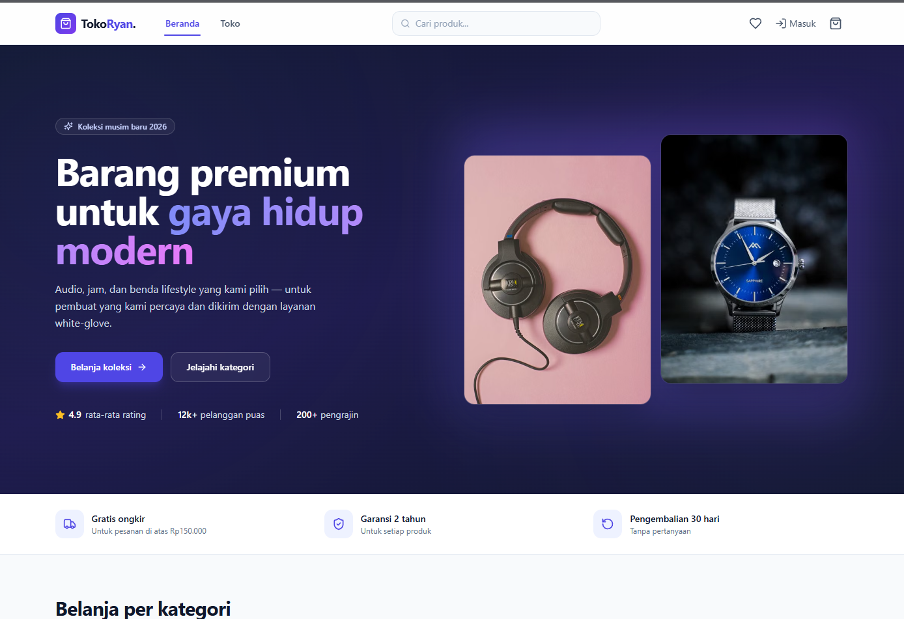
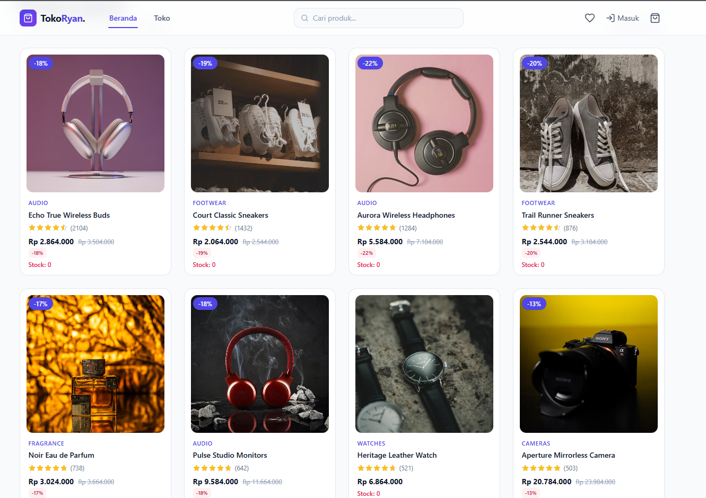

# E-Commerce React App

Aplikasi e-commerce berbasis web yang dibangun dengan **React JS (Vite)**, **Tailwind CSS**, dan **Supabase**.

---

## Tech Stack

- **React JS** — Library JavaScript untuk membangun antarmuka pengguna
- **Vite** — Build tool dan dev server berbasis ES module
- **Tailwind CSS** — Utility-first CSS framework
- **Supabase** — Backend-as-a-Service (auth, database, storage)

---

## Panduan Instalasi

Ikuti langkah-langkah berikut untuk menjalankan proyek ini secara lokal:

### 1. Clone Repository

```bash
git clone https://github.com/username/nama-repo.git
cd nama-repo
```

### 2. Install Dependencies

```bash
npm install
```

### 3. Setup File `.env`

Buat file `.env` di root proyek, lalu salin dan isi dengan kredensial Supabase Anda.

```env
VITE_SUPABASE_URL=
VITE_SUPABASE_ANON_KEY=
```

> **Catatan:** Token di atas sengaja dikosongkan untuk keperluan privasi. Ganti dengan nilai sebenarnya dari proyek Supabase Anda (dapat ditemukan di **Project Settings > API** pada [supabase.com](https://supabase.com)).

### 4. Jalankan Development Server

```bash
npm run dev
```

Buka browser dan akses `http://localhost:5173` untuk melihat aplikasi.

---

## Tampilan Home

Berikut adalah tampilan halaman beranda aplikasi:





---

## Catatan Keamanan

- **Jangan pernah mengunggah file `.env` yang berisi token asli ke GitHub.**
- Pastikan file `.env` ada di dalam `.gitignore` sebelum melakukan commit.
- File `.gitignore` dalam proyek ini sudah meng-include `.env` secara otomatis.

---

## Lisensi

Proyek ini dilisensikan di bawah lisensi MIT.
